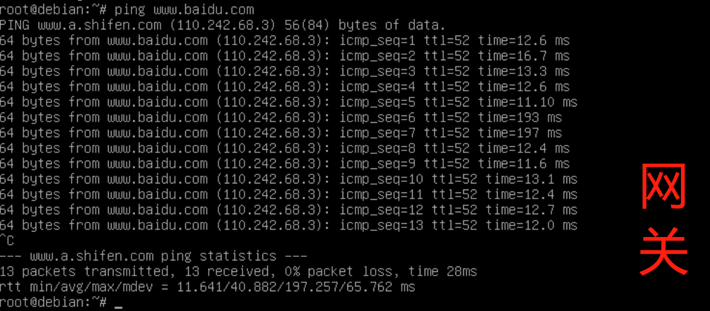

# 基于 VirtualBox 的网络攻防基础环境搭建
## 一、实验目的
* 掌握 VirtualBox 虚拟机的安装与使用；
* 掌握 VirtualBox 的虚拟网络类型和按需配置；
* 掌握 VirtualBox 的虚拟硬盘多重加载；
## 二、实验环境
* VirtualBox 虚拟机
* 攻击者主机（Attacker）：Kali Rolling 2019.2
* 网关（Gateway, GW）：Debian Buster
* 靶机（Victim）：From Sqli to shell / xp-sp3 / Kali
## 三、实验要求
### 1.虚拟硬盘配置成多重加载
### 2.搭建满足要求的虚拟机网络拓扑
### 3.完成以下网络连通性测试；
- [x] 靶机可以直接访问攻击者主机
- [x] 攻击者主机无法直接访问靶机
- [x] 网关可以直接访问攻击者主机和靶机
- [x] 靶机的所有对外上下行流量必须经过网关
- [x] 所有节点均可以访问互联网
## 四、实验步骤
### 1.虚拟硬盘配置成多重加载
VirtualBox虚拟机管理 --- 虚拟介质管理 --- 选中所需的虚拟盘，将属性中的类型修改为多重加载 --- 释放盘片后重新加载虚拟硬盘

### 2.搭建满足条件的虚拟机网络拓扑
- Gateway：需四块网卡
NAT网络，使网关可访问攻击者主机；
仅主机（Host-Only）网络，进行网卡设置；
内部网络intnet1，搭建局域网1；
内部网络intnet2，搭建局域网2。 


- Attacker：需三块网卡
NAT网络;
两块不同的Host-Only. 


-  victim-xp-1:intnet1

-  victim-xp-2:intnet2

-  victim-kali-1:intnet1

-  victim-debian-2:intnet2


| 虚拟机 | ip地址 |
| ----- | ------ |
|kali-attacker | 10.0.2.15|
|victim-xp-1|172.16.111.115|
|victim-xp-2|172.16.222.124|
|victim-kali-1|172.16.111.124|
|victim-debain-2|172.16.222.129|
|Gateway|10.0.2.15|
||192.168.56.113|
||172.16.111.1|
||172.16.222.1|
### 3.完成以下网络连通性测试；
- 靶机可以直接访问攻击者主机

- 攻击者主机无法直接访问靶机

- 网关可以直接访问攻击者主机

  网关可以直接访问靶机

- 靶机的所有对外上下行流量必须经过网关
在网关上开启一个抓包，输入口令：```tcpdump -i enp0s9 -n```
在victim-kali-1上ping百度的网址,k可以在网关上看到了抓取的数据包：

靶机的所有对外上下行流量必须经过网关测试成功。

- 所有节点均可以访问互联网 (以百度为例)



## 五、问题及解决方案
1.[virtualbox打开虚拟硬盘失败](https://blog.csdn.net/cywosp/article/details/41605443)
2.xp系统显示“Windows IP Configuration”

原因：我偷懒使用了Intel PRO/1000的网卡，xp不适合用这么先进的网卡，控制芯片没有适配的驱动造成的上述情况，需将网卡设置为PCnet-FAST III。
## 六、参考资料
[感谢师姐的仓库](https://github.com/CUCCS/2021-ns-public-Lychee00/blob/chap0x01/chap0x01/report01.md)
[以及室友的帮助](https://github.com/CUCCS/2022-ns-public-dangyuyan/blob/chap0x01/chap0x01/chap0x01.md)
[宿舍生活真的为我的学习提供了很多帮助](https://github.com/CUCCS/2022-ns-public-cuclizihan/tree/chap0x01)

