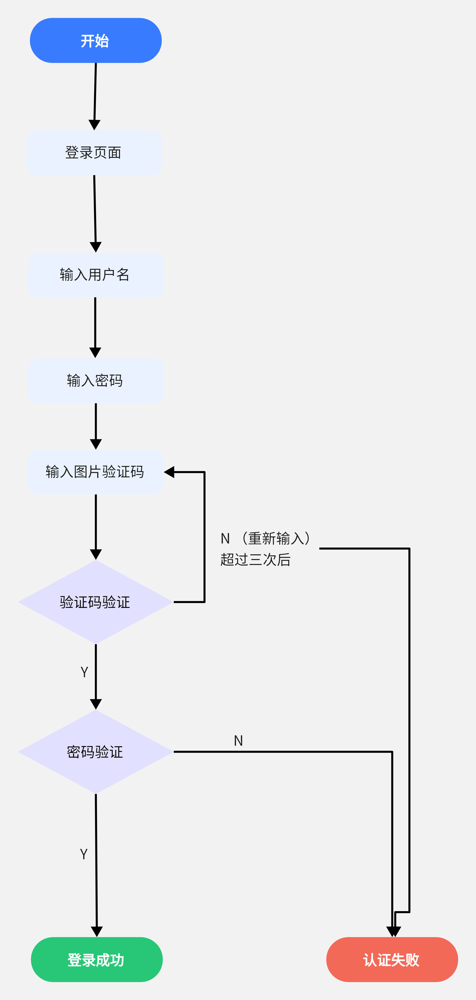

# 第二单元课后题
- 生物特征身份认证方式有哪些？优缺点分析？应用场景举例。
  - 指纹识别
    - 优点：独特性、方便性
    - 缺点：触摸式对于环境要求高，对手指的湿度和清洁度都有要求，可能因为衰老、磨损以及治疗副作用等因素而发生改变，从而导致指纹无法被识别；同时指纹也容易被复制
    - 应用场景：政府、银行、税务、社保、学校和公司机构等部门的文件保密、信息安全、门禁控制、考勤管理与证卡管理等各类需要计算机进行自动身份认证的场合
  - 虹膜识别
    - 优点：准确性、可采集性、独特性和非接触性
    - 缺点：虹膜识别硬件造价较高，大范围推广困难；使用便捷性较差，识别准度略低，反应速度较慢
    - 应用场景：手机上的虹膜识别
  - 人脸识别
     - 优点：非强制性、非接触性和多重性
     - 缺点：人脸可以通过化妆、整容等方式进行伪装，可能无法识别，降低准确性；有可能通过照片等图像，而非本人实际面部识别通过，有较大安全隐患
     - 应用场景：视频监控
  - 声纹识别
     - 优点：方便性、成本低
     - 缺点：同一个人的声音具有易变性，易受身体状况、年龄、情绪等的影响；不同的麦克风和信道对识别性能有影响；环境噪音对识别有干扰；混合说话人的情形下人的声纹特征不易提取
     - 应用场景：公安领域侦破案件
  - 步态识别
     - 优点：非接触性和难伪装性
     - 缺点：在视频行为识别中，将连贯动作从视频流中定位出来较为困难
     - 应用场景：公安领域侦破案件

- “找回口令功能”和“忘记密码”在访问授权机制中的意义？请尝试设计几种安全的“找回口令功能”，详细描述找回口令的用户具体操作过程。
    身份认证是访问授权的基础，没有身份认证就无法实现访问授权。如果主体因为忘记密码而无法认证为主体则难以进行访问授权，“找回口令功能”和“忘记密码”在访问授权机制中的意义是修改访问控制列表中的授权项。
    安全的“找回口令功能”：
    1.绑定手机号码：用户首先需要在登录界面绑定自己的手机号码，每次登录时都会收到一个短信验证码，用以确认身份。当忘记密码时，可以使用绑定的手机号码获取新的登录码。
    2.邮箱验证：用户需要预先绑定自己的邮箱，每次登录时，系统会自动发送一封验证邮件到用户的邮箱，用户可以通过邮件中给出的链接来确认身份。当忘记密码时，可以使用绑定的邮箱获取新的登录码。
    3.安全问题：在注册时，用户需要设置一些安全问题，比如个人出生地，小学校名等，每次登录时都会收到一个安全问题，用以确认身份。当忘记密码时，可以使用此安全问题获取新的登录码。
- 绘制用户使用用户名/口令+图片验证码方式录系统的流程图。
  
- Windows XP / 7 中的访问控制策略有哪些？访问控制机制有哪些？
  ||Windows XP|Windows 7|
  |--|--|--|
  |访问控制策略|1、安全性策略：这些策略设置安全密码策略,控制用户的访问权限，设置用户的安全实践和登录方式。2、网络访问策略：这些策略可以设置网络访问权限，如允许或禁止特定用户访问Internet、允许或禁止特定用户访问共享文件夹、允许或禁止特定用户访问服务器上的文件夹等。3、系统策略：这些策略用来控制用户的对象访问权限，如控制用户可以在计算机上安装硬件、控制用户可以使用的程序、控制用户可以使用的系统功能等。|1. 用户账户控制（UAC）：UAC 是 Windows 7 中的一项安全技术，可确保任何更改系统设置和安装新程序都需要管理员权限。2. 安全设置：通过 Windows 7 的安全设置，用户可以设置来源和文件夹的访问权限，以及网络连接和服务的访问权限。3. 组策略：通过组策略，管理员可以对系统和用户设置权限，以及限制对某些文件夹和程序的访问。4. 安全策略：安全策略可以用来设置系统的安全性，如密码策略、登录策略、系统访问控制等。5. 安全审核：安全审核可以帮助管理员审查系统的安全性，发现可能的弱点，并采取措施防止攻击。|
  |访问控制机制|1. 用户账户控制：通过创建用户账户、分配权限，来限制和控制对操作系统文件和资源的访问。2. 安全策略：使用安全策略，限制用户帐户和组的登录权限，以及管理用户账户的密码计划。3. NTFS（NT文件系统）：NTFS允许您设置文件和文件夹的访问权限，以控制其他用户对它们的访问。4. 安全描述符：安全描述符是一种使用访问控制列表（ACL）来保护文件、文件夹和其他系统对象的机制。5. 网络策略：使用网络策略，可以限制用户帐户的网络访问权限，并管理用户的网络访问行为。6. 安全中心：Windows XP的安全中心是一个安全功能，可以控制用户在系统上的活动，以及它们的对资源的访问。|1. NTFS权限：NTFS权限是Windows 7中最常用的访问控制机制，它提供了对文件和文件夹的可配置的读取和写入访问权限。2. 组策略：组策略是一种组织级别的安全控制机制，它包括系统和用户级别的安全设置，如登录/注销设置、安全更新、病毒检查器设置、禁用恶意软件和USB设备等。3. 访问控制列表：访问控制列表（ACL）是Windows 7中用于配置计算机资源访问权限的机制，它提供了可以针对特定用户组或用户设置访问权限的功能。4. 加密文件系统：加密文件系统（EFS）是Windows 7中可以保护数据安全的一种机制，它使用加密可以保护计算机上存储的文件，以防止未经授权的用户访问。5. 用户账号控制：用户账号控制（UAC）是Windows 7中的一种安全机制，它可以防止未经授权的用户试图更改系统设置或安装未经许可的应用程序。|
- 用权限三角形模型来理解并描述下 2 种威胁模型：提权、仿冒。
权限三角形模型三要素：用户，角色，权限。
- - 提权
  提权表示用户尝试提高自己的权限，以便访问更高级别的敏感信息。在权限三角形模型中，提权表示用户试图从低级权限向高级权限转移。
- - 仿冒
  仿冒表示攻击者伪装成另一个用户，以便访问该用户的敏感信息。在权限三角形模型中，仿冒表示攻击者尝试从低级权限转移到其他用户的高级权限。
- 试通过操作系统的访问控制机制来达到预防一种真实病毒的运行目的。
  可以通过禁止病毒所需要访问的文件、文件夹和网络，屏蔽它们的运行，从而阻止病毒的传播。
- 什么是 OAuth？
  OAUTH是一种开放的协议，它允许用户授权第三方应用程序访问他们的在线资源，而不需要将用户名和密码提供给第三方应用程序。
- 什么是 OpenID？
  OpenID是一个去中心化的网上身份认证系统。它允许用户使用一个唯一的标识符（例如URL）在不同的网站上进行登录，而不需要在每个网站上重新输入用户名和密码。
- 试用本章所学理论分析 OAuth 和 OpenID 的区别与联系。
  OAuth 与 OpenID 之间的联系在于，它们都是用于在网站之间共享用户信息的安全机制，但它们的功能有所不同。OAuth 用于授权第三方应用程序访问用户的在线资源，而 OpenID 用于提供统一的用户身份验证机制，以允许用户在不同的网站上使用单一的用户名和密码登录。
- 如何使用 OAuth 和 OpenID 相关技术实现单点登录（Single Sign On）？
  单点登录是指用户只要登录一次就可以访问多个应用程序或网站的技术。
  OAuth 授权可以用来实现单点登录，当用户使用 OAuth 授权登录一个网站时，网站会发放一个授权令牌，这个令牌可以用来访问其他网站。
  OpenID 用户使用 OpenID 登录一个网站时，网站会发放一个 OpenID 令牌，这个令牌可以用来登录其他网站。
  因此，用户只需要在第一次登录时输入用户名和密码，然后可以访问多个网站，而不需要在每个网站上输入用户名和密码。