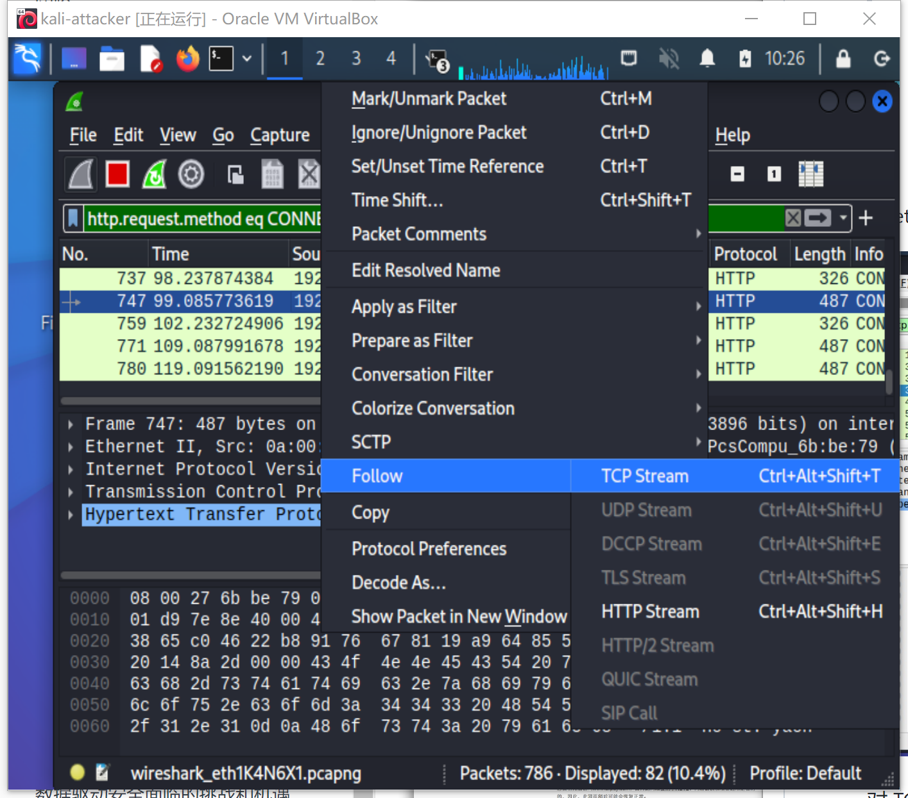

# 实验三 HTTP代理服务器实验
## 一、实验目的
- [x] 实验验证：在Kali Linux中安装tinyproxy，然后用主机设置浏览器代理指向tinyproxy建立的HTTP正向代理，在Kali中用wireshark抓包，分析抓包过程，理解HTTP正向代理HTTPS流量的特点。
- [x] 了解什么是HSTS
## 二、实验环境
- 虚拟机：kali-attacker 192.168.56.101
- 宿主机：Windows11 192.168.56.1

## 三、实验内容
### 1.建立 HTTP 正向代理
安装 tinyprox
```
# 安装 tinyproxy
apt-get update
apt-get install tinyproxy

# 启动 tinyproxy
sudo systemctl start tinyproxy
```
修改配置
```
# 编辑tinyproxy，取消Allow 10.0.0.0/8行首注释
vim /etc/tinyproxy/tinyproxy.conf
# 取消下面两行的注释
Allow 10.0.0.0/8
Allow 192.168.0.0/16

# 重启服务
/etc/init.d/tinyproxy start

# 设置虚拟机联网方式为Host-Only和NAT，默认tinyproxy监听8888端口
```

用主机设置浏览器代理指向 tinyproxy 建立的HTTP正向代理服务地址

### 2.wireshark进行抓包
在kali 虚拟机里开启 wireshark 抓包
```
# 开启 wireshark 服务
wireshark
```
eth1是用来连接宿主机和代理服务器的

对eth1抓取的流量使用 `http.request.method eq CONNECT` 可查看所有HTTPS代理请求，选中右键进行追踪流。

观察到，代理服务器会发送Connect请求到http代理服务器，导致代理完全清楚我们正在访问哪一个站点，但并不清晰明文与具体内容。

## 总结
1.代理服务器不知道客户端和服务器的 HTTPS 通信内容，但代理服务器知道客户端访问了哪个 HTTPS 站点，这是由 http 代理的协议机制决定的：代理客户端会发送 Connect 请求到 http 代理服务器。HTTP 代理服务器在转发客户端请求时，可能会添加 Via 字段，从而向目标站点暴露客户端正在使用代理访问。类似的，匿名通信应用 tor 的部分出口节点也会在http请求中自动加入 via 字段，向被访问站点宣告：当前请求正在使用匿名通信网络 tor 提供的匿名通信服务。
2.HSTS（HTTP Strict Transport Security）机制：
- 服务器通过实现 HSTS 机制，可以帮助客户端（例如浏览器）强制
- - 客户端和服务器之间的所有通信流量必须使用 HTTPS
- - SSL 证书合法性校验
## 遇到的问题及解决方案
1.有关vim命令：
个人对于vim命令经常容易编辑出错，所以此处选用了gedit命令
`gedit /etc/tinyproxy/tinyproxy.conf`可以在新窗口中进行编辑
2.`/etc/init.d/tinyproxy start`遇到重启失败的时候可以再次使用
## 参考代码及文献

[课本](https://c4pr1c3.github.io/cuc-ns/chap0x03/exp.html)
[Ning-Lorraine的仓库](https://github.com/CUCCS/2022-ns-public-Ning-Lorraine/tree/chap0x03/chap0x03)