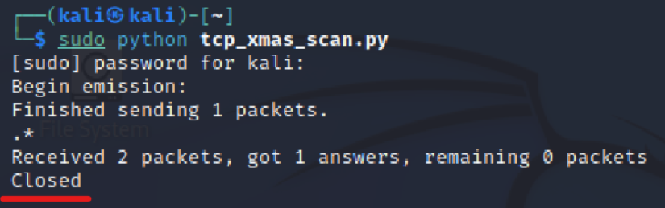

# 基于 Scapy 编写端口扫描器
## 一、实验目的
- 掌握网络扫描之端口状态探测的基本原理
## 二、实验环境
- python + scapy
- 网关：Debian
- 攻击者：Attacker-kali 172.16.111.133
- 受害者：Victim-kali 172.16.111.104
## 三、实验要求
- 完成以下扫描技术的编程实现
- [x] TCP connect scan / TCP stealth scan
- [x] TCP Xmas scan / TCP fin scan / TCP null scan
- [x] UDP scan
- [x] 上述每种扫描技术的实现测试均需要测试端口状态为：开放、关闭和过滤状态时的程序执行结果
- [x] 提供每一次扫描测试的抓包结果并分析与课本中的扫描方法原理是否相符？如果不同，试分析原因；
- [x] 在实验报告中详细说明实验网络环境拓扑、被测试 IP 的端口状态是如何模拟的
## 四、实验过程
#### 端口状态设置
查看当前防火墙的状态和现有规则
`ufw status`
关闭状态：对应端口没有开启监听, 防火墙没有开启
`ufw disable`
开启状态：对应端口开启监听，防火墙处于关闭状态
- apache2基于TCP, 在80端口提供服务
`systemctl start apache2 # port 80`
- DNS服务基于UDP,在53端口提供服务
`systemctl start dnsmasq # port 53`
过滤状态：对应端口开启监听, 防火墙开启
```
  ufw enable && ufw deny 80/tcp
  ufw enable && ufw deny 53/udp
```
#### TCP connect scan
TCP connect scan先发送一个S，然后等待回应。如果有回应且标识为RA，说明目标端口处于关闭状态；如果有回应且标识为SA，说明目标端口处于开放状态。这时TCP connect scan会回复一个RA，在完成三次握手的同时断开连接。
```
#! /usr/bin/python

from scapy.all import *

src_port = RandShort()
dst_ip = "172.16.111.133"
dst_port=80

resp = sr1(IP(dst=dst_ip)/TCP(sport=src_port,dport=dst_port,flags="S"),timeout=10)

if resp is None:
    print("Filtered")
elif(resp.haslayer(TCP)):
    if(resp.getlayer(TCP).flags == 0x12):
        send_rst = sr(IP(dst=dst_ip)/TCP(sport=src_port,dport=dst_port,flags="AR"),timeout=10)
        print("Open")
    elif (resp.getlayer(TCP).flags == 0x14):
        print("Closed")
```
- 关闭状态：
防火墙关闭，80端口未开启监听


运行代码：

抓取数据包并分析，接收到RST/ACK数据包，说明80端口处于关闭状态

- 开启状态：
防火墙关闭，开启80端口的监听

抓取数据包并分析，成功完成三次握手

- 过滤状态：
防火墙开启，过滤80端口

运行代码：

抓取数据包并分析，只接收到一个TCP包


#### TCP Xmas scan
一种隐蔽性扫描。仅发送 FIN 包，它可以直接通过防火墙。当处于端口处于关闭状态时，会回复一个RST包；如果端口是开放或过滤状态则对 FIN 包没有任何响应。
```
#! /usr/bin/python

from scapy.all import *

dst_ip = "172.16.111.133"
dst_port = 80

resp = sr1(IP(dst=dst_ip)/TCP(dport=dst_port,flags="FPU"),timeout=10)

if resp is None:
    print("Open|Filtered")

elif(resp.haslayer(TCP)):
    if(resp.getlayer(TCP).flags == 0x14):
        print("Closed")

elif(resp.haslayer(ICMP)):
    if(int(resp.getlayer(ICMP).type)==3 and int(resp.getlayer(ICMP).code) in [1,2,3,9,10,13]):
        print("Filtered")
```

- 关闭状态：
防火墙关闭，80端口未开启监听
运行代码：

抓取数据包并分析，接收到RST/ACK数据包，说明80端口处于关闭状态

- 开启状态：
防火墙关闭，开启80端口的监听

抓取数据包并分析，只接收到一个TCP包没有响应，说明端口处于开启/过滤状态

- 过滤状态：
防火墙开启，过滤80端口

运行代码：

抓取数据包并分析，只接收到一个TCP包没有响应，说明端口处于开启/过滤状态


#### UDP scan
一种开放式扫描，通过发送零字节的UDP包进行扫描。当收到UDP回复时，该端口为开启状态；若没有回复，可能为开启/过滤状态。收到ICMP端口不可达错误，说明端口关闭。
```
from scapy.all import *

dst_ip = "172.16.111.133"
dst_port = 53

resp = sr1(IP(dst=dst_ip)/UDP(dport=dst_port),timeout=10)

if resp is None:
    print("Open|Filtered")

elif(resp.haslayer(UDP)):
    print("Open")

elif(resp.haslayer(ICMP)):
    if(int(resp.getlayer(ICMP).type)==3 and int(resp.getlayer(ICMP).code)==3):
        print("Closed") 
    elif(int(resp.getlayer(ICMP).type)==3 and int(resp.getlayer(ICMP).code) in [1,2,9,10,13]):
        print("Filtered")
```
- 关闭状态：
防火墙关闭，53端口未开启监听
运行代码：

抓取数据包并分析，发送了ICMP端口不可达的数据包，说明端口处于关闭状态

- 开启状态：
安装`dnsmasq.service`防火墙关闭，53窗口开启监听

抓取数据包并分析，接受了victim-kali发送的UDP数据包并发送了响应包，说明端口处于开启状态

- 过滤状态：
防火墙开启，过滤53端口

运行代码：

抓取数据包并分析，接收到victim-kali发送的UDP数据包，但没有做出响应，说明端口处于过滤状态


## 五、参考文献
[电子课本](https://c4pr1c3.github.io/cuc-ns/chap0x05/exp.html)
[如何用Scapy写一个端口扫描器](https://blog.csdn.net/think_ycx/article/details/50898096)